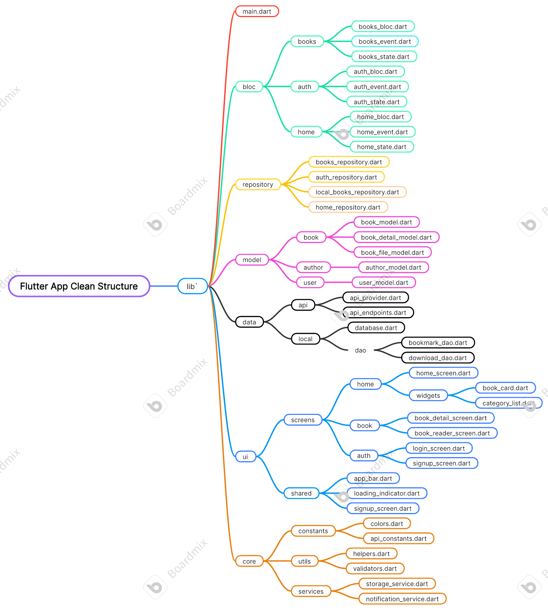

# 🗓️ Day 33 — The Most Common Mistakes Developers Make with BLoC, MVVM, Provider & GetX

After years of building Flutter apps, I’ve realized —  
**the problem isn’t the architecture.**  
It’s **how we use it.**

Here are the **6 biggest mistakes** I see developers make 👇

---

### 1️⃣ Mixing UI and Logic
Putting HTTP calls or business logic directly in widgets breaks *separation of concerns.*  
👉 Keep **UI reactive**, **logic in BLoC/ViewModel**, and **data in Repository.**

---

### 2️⃣ API Calls Without Layers
Don’t call APIs directly in your BLoC.  
Use a structure like:
API → Repository → BLoC → UI

---

### 3️⃣ Local DB Direct Access
Never call Hive or SQLite directly from UI.  
Create a **LocalDataSource** and connect it through **Repository** for an **offline-first** design.

---

### 4️⃣ Over-Engineering Too Early
You don’t need enterprise architecture for a to-do app.  
Add layers **when needed** — but name and structure them consistently.

---

### 5️⃣ Poor State Discipline
Whether using **Provider**, **BLoC**, or **GetX** —  
manage rebuilds, close streams, and dispose controllers properly.

---

### 6️⃣ Treating Architecture Like a Trend
Frameworks change — **good architecture stays.**  
✅ *Predictability > Perfection.*

---

💡 I’m applying all this to my **180 Days Challenge** — building **Kitaab Kiosk**, a 360° book ecosystem app.  
**Clean architecture from day one helps avoid chaos later.**

---

> 🧭 **Remember:**  
> You don’t need *perfect architecture* — just a *predictable one.*

---

🖼️ *Image below depicts a simple and powerful Flutter app structure — hope it helps!*

---

## 🔗 Connect with Me

- 💼 [LinkedIn](https://www.linkedin.com/in/er-sandeep-singh-sidhu/)
- 📰 [Blog](https://www.flutterfumes.com)
- ✍️ [Medium](https://medium.com/@deep1931)
- 💡 [Hashnode](https://flutterfumes.hashnode.dev)

---

⭐ *If you found this useful, don’t forget to star the repo and share your thoughts!*
